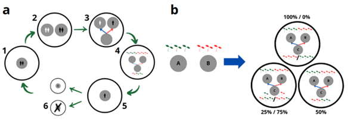

# Introduction

This supplementary material presents the demographic model used as the foundation for the main model. The model was implemented in python and the code is available in the repository inside the folder `kin-transmission-model`. More details can be consulted in the code. Unlike the main model, this version does not incorporate post-marital residence rules, functioning instead as an isolated community where households interact solely based on kinship rules. This simplification allows us to isolate and examine the independent effects of inheritance and kinship systems on agrobiodiversity maintenance, providing a baseline against which the dynamics introduced by post-marital residence — implemented in the main model — can be better understood. Additional information can be consulted in the ODD Protocol.

# Model

## Model Description

The model begins with the creation of N initial households and V initial varieties in the community. Each household is assigned a specific number of potential children, drawn from a Poisson distribution with a mean of c. These values represent "child slots", which determine the maximum number of children that reach marriageable age (≥15 years). Each household is then assigned to a clan according to the kinship system. In the Endogamy scenario, no clans were assigned; in the Dual Organization system, households were assigned to two clans; and in the Generalized Exchange system, they were distributed among three clans. After initialization, each household randomly selected v varieties from the original community set of V initial varieties, without replacement. As a result, while the total diversity at the community level was initially set at V, these varieties were randomly distributed among the households rather than shared evenly across the community.

Each simulation year consisted of six sequential phases (@fig-model, a). First, each household had a 30% probability of producing a child to fill one of its available child slots. If all slots were already occupied, the household skipped this step. Next, once a household had a daughter who did reach marriageable age, it sought a partner for her in the community. The partner had to belong to a different household, could not be considered family (defined here as grandparents, parents, children, or grandchildren), and should follow the marriage rules dictated by the kinship system.

To simulate different kinship system cycles, we introduced partner selection preferences based on clan affiliation, but we considered that in real situations not always the kinship rules are followed. In the Endogamy system, where marriages occur within the same group, no additional rule was required. In contrast, for the Dual Organization system, a 0.2 probability was introduced to define the clan incest rate; thus, each time a household sought a partner for its daughter, there was a 20% chance of selecting one from the same group. For the Generalized Exchange system, where marriages occurred among three clans, partner selection considered a 0.2 probability of selecting a partner from a non-ideal clan, while 1/3 of this value (0.06) represented the probability of choosing a partner from the same clan instead of an external one. If a suitable partner was found, a new household was created (third phase) and inherited crop varieties from both its paternal and maternal families (fourth phase). To regulate population size, we implemented a household removal mechanism: once the system exceeded 150 households, the addition of new households leads to the removal of the older ones. Inheritance was determined by the parameter h, which specified the percentage of maternal varieties passed on to the new household, while the remaining percentage came from the paternal family. If the calculated number of inherited varieties was not an integer, the model rounded up to the next whole number, introducing minor variation in the number of varieties inherited across households depending on the value of h (e.g., $h$ = 0 vs. h = 50; @fig-model, b). However, as shown in our results, these round differences do not significantly impact overall diversity patterns. Each inherited variety remained identical to its ancestor's variety, reflecting cassava's asexual reproduction.

{#fig-model}

At the end of each simulation year, households aged (parents and their unmarried children - fifth phase) and faced a probability of mortality (sixth phase). The Gompertz-Makeham law was used to model the probability of household death as a function of age: $μ(x)= α+ δ ⋅e^{βx}$ , where $μ(x)$ represents the probability of death at age $x$. The rest of the parameters are: $α$=0, representing age-independent mortality; $δ$=0.01, the baseline mortality at the starting age; and $β$=0.06, the rate at which mortality increases with age.

As our interest lies in the role of kinship systems and inheritance mechanisms, the model incorporates simplifying assumptions. Those are: an isolated community, with no migration or external interactions; no horizontal transmission, like seed exchange between households; no environmental influence; asexual reproduction of cassava, with varieties inherited without changes; fixed kinship and marriage rules, operating once at a time; a household replacement mechanism, where the oldest household is removed once a threshold is reached to regulate population size; and discrete time steps, where each cycle represents one year with demographic events occurring at fixed intervals.

## Experiments

We designed two groups of experiments to analyze the role of different kinship systems and inheritance norms in shaping cassava diversity. To assess the impact of these factors, we also implemented a null model. The null model differed only in the inheritance mechanism: instead of acquiring varieties from parental households, each new household selected v varieties at random and without replacement from the available varieties at that moment.

In the first group of experiments, we tested different values of the inheritance parameter h across kinship systems. Specifically, for each kinship system, we tested h values of 0, 25, 50, 75, and 100, along with the null model. Population parameters were set to minimize the likelihood of system extinction, according to our validations, while variety parameters were selected based on a previous model (@sanchesIntegratedModelStudy2022). In the second group of experiments, we performed a sensitivity analysis by varying both population and variety parameters across kinship systems, while also testing different values of h. The population parameters were varied to examine the impact of initial conditions (Initial Number of Households, N) and population growth rate (children per family, c). The variety parameters were varied to assess the role of initial diversity (Initial Number of Varieties, V) and variety distribution within households (Varieties per Household, v). This time we tested h values of 0, 25, 50, the null model, and one additional population or variety parameter.

For each experimental configuration, we conducted runs of 1,000 cycles. Cases where the system went extinct due to population dynamics were excluded from the final analysis, thus only 100 successful runs were considered. A detailed summary of the parameters used in the experiments is provided in @tbl-parameters.

| Parameter | Explanation | Values Exp. 1 | Values Exp. 2 |
|:-----------------|:-----------------|:-----------------|:-----------------|
| *N* | Initial number of households in the system | 40 | 10, 20, 30, 40, 50, 60, 70, 80, 90, 100 |
| *p* | Annual probability of having a child | 0.3 | 0.3 |
| $β$ | Rate at which mortality increases with age | 0.06 | 0.06 |
| *c* | Average number of children per household | 4 | 1, 2, 3, 4, 5, 6, 7, 8, 9, 10 |
| *V* | Initial number of varieties in the system | 10 | 10, 20, 30, 40, 50, 60, 70, 80, 90, 100 |
| *v* | Varieties per household | 3 | 1, 2, 3, 4, 5, 6, 7, 8, 9, 10 |
| *h* | Inheritance value / random model | 0, 25, 50, 75, 100, random | 0, 25, 50, random |
| *K* | Kinship systems | Endogamy, Dual Organization, Generalized Exchange | Endogamy, Dual Organization, Generalized Exchange |

: Parameters used for simulations in all configurations. {#tbl-parameters}

## Model validation

Since empirical data on cassava’s diversity (@sanchesIntegratedModelStudy2022) and specifically on inheritance in traditional communities was unavailable in the literature, we validated the model in two steps. First, we assessed whether kinship behavior aligned with theoretical expectations from anthropological literature. Second, we tested different values for key population parameters to identify those that produced the most appropriate demographic patterns.

To evaluate kinship structure, we examined whether the model generated marriage cycles consistent with anthropological theory (@itaoEmergenceKinshipStructures2022, @levi-straussStructuresElementairesDela1949). In this context, a cycle is defined as a network that starts and ends at the same point. A cycle length 1 represents an intra-clan marriage (A →A), a cycle of length 2 involves two clans (A →B →A) and a cycle of length 3 involves three clans (A →B →C →A). Thus, we simulated our kinship systems 100 times for 1,000 steps and counted the number of cycles of marriage between clans. In other words, we counted how many times our model produced connections between clans of different lengths.

Endogamy was excluded from this analysis as it produces only cycles of 1. As expected, Dual Organization system presented a higher proportion of marriage cycles of length 2, while the Generalized Exchange system showed more frequent marriage cycles of length 3 (@fig-validation-cycles), matching theoretical predictions.

```{python}
#| label: fig-validation-cycles
#| fig-cap: "Percentage of cycles in Dual Organization and Generalized Exchange."
#| fig-width: 8
#| fig-height: 6

import seaborn as sns
import os
import json
import numpy as np
import pandas as pd
import matplotlib.pyplot as plt

folder_name = "Main/Outputs/results_validation/kinship_validation/"

with open(os.path.join(folder_name, "validation_dual_organizations.json"), "r") as f:
    loaded_val_dual = json.load(f)

with open(os.path.join(folder_name, "validation_generalized_exchange.json"), "r") as f:
    loaded_val_gen = json.load(f)

dual = {
    "1 cycle": np.mean(loaded_val_dual["cycles"][0]),
    "1 cycle std": np.std(loaded_val_dual["cycles"][0]),
    "2 cycle": np.mean(loaded_val_dual["cycles"][1]),
    "2 cycle std": np.std(loaded_val_dual["cycles"][1]),
    "3 cycle": np.nan,
    "3 cycle std": np.nan,
    "mean population": np.mean(loaded_val_dual["final_pop"])
}

gen = {
    "1 cycle": np.mean(loaded_val_gen["cycles"][0]),
    "1 cycle std": np.std(loaded_val_gen["cycles"][0]),
    "2 cycle": np.mean(loaded_val_gen["cycles"][1]),
    "2 cycle std": np.std(loaded_val_gen["cycles"][1]),
    "3 cycle": np.mean(loaded_val_gen["cycles"][2]),
    "3 cycle std": np.std(loaded_val_gen["cycles"][2]),
    "mean population": np.mean(loaded_val_gen["final_pop"])
}

df = pd.DataFrame(
    {"Dual Organization": dual,
     "Generalized Exchange": gen}
).T

systems = ["Dual Organization", "Generalized Exchange"]
cycles = ["1 cycle", "2 cycle", "3 cycle"]

means = df[cycles].fillna(0).to_numpy()
errors = df[[f"{c} std" for c in cycles]].fillna(0).to_numpy()

x = np.arange(len(systems))
width = 0.2

fig, ax = plt.subplots(figsize=(8, 6))

for i, cycle in enumerate(cycles):
    ax.bar(
        x + i * width - width,
        means[:, i],
        width,
        yerr=errors[:, i],
        label=cycle,
        capsize=4
    )

ax.set_xlabel("Kinship System", size=18)
ax.set_ylabel("Percentage of Cycles", size=18)
ax.set_xticks(x)
ax.set_xticklabels(systems)
ax.legend(title="Length of the Cycle")
ax.grid(axis="y", linestyle="--", alpha=0.7)

plt.tight_layout()
plt.show()
```

Additionally, to validate the model’s population behavior, we tested different values of three key parameters: initial number of households ($N$), children per household ($c$), and rate at which mortality probability increases with age ($β$). Our objective was to ensure that the system (1) avoided extinction and (2) prevented excessive population growth over time. Here we present only the results for the Endogamy system because the only change implemented among systems was the frequence of extinction for each configuration; data for the other kinship systems can be consulted in the supporting material.

We first tested different combinations of $N$ and $c$, while keeping the mortality rate fixed at $β$ = 0.06 (@fig-endogamy-heatmaps, a). Results showed that when $c$ \< 4 extinction was frequent, regardless of $N$. Even for values of $c$ = 4, extinction rates remained high when $N$ \< 20, as small initial population sizes made long-term survival unlikely. However, for $N$ ≥ 20 and $c$ ≥ 4, the system avoided extinction more frequently. From these results, we selected $N$ = 40 and $c$ = 4 as appropriate values, ensuring a low risk of extinction while maintaining household turnover at a reasonable rate.

Next, we examined how different combinations of N and β influenced population dynamics while keeping c constant in 4 (@fig-endogamy-heatmaps, b). When β \< 0.065, as households died earlier, extinction was more frequent across all values of N, suggesting that households did not persist long enough to generate replacements. However, for β ≥ 0.065, extinction cases decreased. For N = 40, a β value of 0.06 establishes a balance between mortality and new household formation, preventing both excessive persistence and frequent extinctions.

Finally, we analyzed the combined effects of c and β, while keeping the initial number of households (N) fixed at 40 (@fig-endogamy-heatmaps, c). As observed in previous experiments, when c \< 4, extinction was inevitable, regardless of β. However, at c ≥ 4, household numbers remained within a controlled range, provided that β ≥ 0.06. Lower values of β (e.g., 0.055) resulted in a rapid increment of households, as mortality was insufficient to counterbalance household creation. With values of β = 0.06, household behavior ensured long-term population persistence. Based on these results, we used as main parameters: N = 40, as it minimized extinction risk while maintaining a plausible starting population for each kinship system; c = 4, as it provided a sufficient birth rate to sustain the population; and β = 0.06, as it ensured a realistic mortality rate for households without excessive household persistence.

The population dynamics observed in the model validation were similar across the three kinship systems. However, the Endogamous system consistently resulted in higher average household numbers, followed by Dual Organization, with Generalized Exchange producing the lowest numbers. This pattern likely reflected the challenges households faced in adhering to kinship rules, as strict constraints led to instances where many households did not create new ones and eventually disappeared, lowering the overall system average. Importantly, this lower number of households does not indicate a different demographic pattern, but rather that the system faced extinction more frequently. Similar findings have been suggested in other modelling studies, where restrictive marriage rules often result in deviations from prescribed norms (Kunstadter et al., 1963).

```{python}
import numpy as np
import matplotlib.pyplot as plt

def plot_heatmap_ax(
    ax,
    data,
    alphas,
    betas,
    alpha_label,
    beta_label,
    variable,
    colorbar_range=(0, 150),
    colorbar_label="Households"
):
    """
    Plot a heatmap on an existing matplotlib axis.
    """

    values = np.array([[entry[variable] for entry in row] for row in data])

    im = ax.imshow(
        values,
        vmin=colorbar_range[0],
        vmax=colorbar_range[1]
    )

    ax.set_xticks(np.arange(len(betas)))
    ax.set_yticks(np.arange(len(alphas)))

    ax.set_xticklabels([f"{b:.3f}" for b in betas])
    ax.set_yticklabels([f"{a:.1f}" for a in alphas])

    for i in range(len(alphas)):
        for j in range(len(betas)):
            ax.text(
                j, i,
                f"{values[i, j]:.1f}",
                ha="center",
                va="center",
                color="white",
                fontsize=8
            )

    plt.setp(
        ax.get_xticklabels(),
        rotation=45,
        ha="right",
        rotation_mode="anchor"
    )

    ax.set_ylabel(alpha_label)
    ax.set_xlabel(beta_label)

    return im
# Data
n = 4
m = 40
malphas = np.linspace(1,n,n) 
mbetas = np.linspace(10,m,int(m/10))     
folder_name = "Main/Outputs/results_validation/populational behavior/Endogamy/"
heat_std = os.path.join(folder_name, 'Endo_beta_fixed.npy')
mM_datos = np.load(heat_std, allow_pickle=True)

iniciais = 40
n = 4
ualphas = np.linspace(1,n,n) # Average number of children: from 1 to n
ubetas = np.linspace(0.055, 0.075, 5) # Beta from 0.055 to 0.075
heat_std = os.path.join(folder_name, 'Endo_UDin_fixed.npy')
uM_datos = np.load(heat_std, allow_pickle=True)

media = 4
n = 40
halphas = np.linspace(10,n,int(n/10)) # Initial UDs from 10 to n
hbetas = np.linspace(0.055, 0.075, 5) # Beta from 0.055 to 0.075
heat_std = os.path.join(folder_name, 'Endo_Mean_fixed.npy')
hM_datos = np.load(heat_std, allow_pickle=True)
```

```{python}
#| label: fig-endogamy-heatmaps
#| fig-cap: "Effects of parameter combinations on the final number of households under endogamy. Panels show (a) mean children versus initial households, (b) mean children versus mortality parameter β, and (c) initial households versus mortality parameter β."

fig, axes = plt.subplots(
    1, 3,
    figsize=(18, 6),
    constrained_layout=True
)

im1 = plot_heatmap_ax(
    axes[0],
    mM_datos,
    malphas,
    mbetas,
    "Mean Children",
    "Initial Households",
    "alive",
    (0, 150)
)

axes[0].set_title("(a) Mean Children × Initial Households")

im2 = plot_heatmap_ax(
    axes[1],
    uM_datos,
    ualphas,
    ubetas,
    "Mean Children",
    "Beta",
    "alive",
    (0, 150)
)

axes[1].set_title("(b) Mean Children × Beta")

im3 = plot_heatmap_ax(
    axes[2],
    hM_datos,
    halphas,
    hbetas,
    "Initial Households",
    "Beta",
    "alive",
    (0, 150)
)

axes[2].set_title("(c) Initial Households × Beta")

# One shared colorbar
cbar = fig.colorbar(
    im1,
    ax=axes,
    shrink=0.8
)
cbar.set_label("Households")

plt.show()
```

# Results

Our first experiment shows that diversity at the community level decreased over time (@fig-diversity-change-endogamy). However, compared to the null model, inheritance mechanisms slowed the rate of diversity loss: in the null model, where inheritance was absent, diversity declined rapidly, whereas in the inheritance models, diversity decreased at a slower pace. The divergence between inheritance and null models occurred between cycles 50 and 80, when the inheritance process became active. After this phase, diversity in the inheritance models remained consistently higher than in the null model. This trend persisted across different kinship systems and values of parameter h (@fig-community-diversity-inheritance). Differences in diversity loss rates across kinship systems were small, with all models following a similar pattern of decline. Similarly, varying the inheritance parameter (h) did not substantially alter the overall patterns of diversity loss across tested configurations. In all cases, inheritance mechanisms resulted in lower diversity loss than the null model: while diversity loss rates in the null model ranged from 40% to 75% by the end of the simulation, inheritance models consistently showed a lower loss rate, ranging from 20% to 55%.

```{python}
#| label: fig-diversity-change-endogamy
#| fig-cap: Temporal change in community-level diversity under Endogamy for different values of the inheritance parameter (*h*). Lines represent the mean diversity across simulation runs.

def diveristy_change(data, inheritance, kinship_system):
  palette = sns.color_palette("tab10", len(inheritance))
  plt.figure(figsize=(10, 6))
  for idx, inherit in enumerate(inheritance):
      medias = np.mean(data[1][inherit], axis=0)
      desviaciones = np.std(data[1][inherit], axis=0)

      # Assign colors from tab10 palette
      color = palette[idx]

      if inherit == 'False':
          plt.plot(time_graf, medias, label='Random', color=color)
          # plt.fill_between(time_graf, medias - desviaciones, medias + desviaciones, color=color, alpha=0.2, label=f'Std {inherit}')
      else:
          plt.plot(time_graf, medias, label=f'{inherit} %', color=color)
          # plt.fill_between(time_graf, medias - desviaciones, medias + desviaciones, color=color, alpha=0.2, label=f'Std {inherit}')

  plt.xlabel('Steps')
  plt.ylabel('Diversity at the community level')
  plt.ylim(bottom=0)
  plt.title(f'Diversity change at the community level. {kinship_system}')
  plt.legend()
  plt.grid(True)
  return plt
view = 50
t = 1000 #steps of the simulation
time_graf = list(range(0, t+1, view))
folder_name = os.path.join(
    "Main/Outputs",
    "First experiments"
)
inherit_steps_endo_path = os.path.join(folder_name, "Endogamy", 'inherit_steps_data_endo.json')
        
with open(inherit_steps_endo_path, "r") as json_file:
    loaded_data_inherit_steps_endo = json.load(json_file)

inheritance = ["0", "25", "50", "75", "100", "False"]

plot = diveristy_change(
    loaded_data_inherit_steps_endo,
    inheritance,
    "Endogamy"
)

plot.tight_layout()
plot.show()
```

```{python}
#| label: fig-community-diversity-inheritance
#| fig-cap: Community-level diversity across values of the inheritance parameter (*h*) for Endogamy, Dual Organization, and Generalized Exchange. Points indicate means and error bars represent one standard deviation across simulation runs.

inherit_endo_path = os.path.join(
    folder_name,
    "Endogamy",
    "inherit_data_endo.json"
)

with open(inherit_endo_path, "r") as json_file:
    loaded_data_inherit_endo = json.load(json_file)

inherit_dual_path = os.path.join(
    folder_name,
    "Dual Organization",
    "inherit_data_dual.json"
)

with open(inherit_dual_path, "r") as json_file:
    loaded_data_inherit_dual = json.load(json_file)

inherit_restricted_path = os.path.join(
    folder_name,
    "Generalized Exchange",
    "inherit_data_generalized.json"
)

with open(inherit_restricted_path, "r") as json_file:
    loaded_data_inherit_restricted = json.load(json_file)

mean_div_com_restricted = []
std_div_com_restricted = []

mean_div_com_dual = []
std_div_com_dual = []

mean_div_com_endo = []
std_div_com_endo = []

inheritance = ["0", "25", "50", "75", "100", "False"]

for i in inheritance:
    mean_div_com_restricted.append(
        np.mean(loaded_data_inherit_restricted[i][1])
    )
    std_div_com_restricted.append(
        np.std(loaded_data_inherit_restricted[i][1])
    )

    mean_div_com_dual.append(
        np.mean(loaded_data_inherit_dual[i][1])
    )
    std_div_com_dual.append(
        np.std(loaded_data_inherit_dual[i][1])
    )

    mean_div_com_endo.append(
        np.mean(loaded_data_inherit_endo[i][1])
    )
    std_div_com_endo.append(
        np.std(loaded_data_inherit_endo[i][1])
    )

inheritance_possibilities = [
    "0", "25", "50", "75", "100", "Random"
]

palette = sns.color_palette("tab10")

fig, ax = plt.subplots(figsize=(10, 6))

ax.errorbar(
    inheritance_possibilities,
    mean_div_com_restricted,
    yerr=std_div_com_restricted,
    fmt="o",
    capsize=5,
    capthick=2,
    color=palette[0],
    ecolor=palette[0],
    label="Generalized Exchange"
)

ax.errorbar(
    inheritance_possibilities,
    mean_div_com_dual,
    yerr=std_div_com_dual,
    fmt="s",
    capsize=5,
    capthick=2,
    color=palette[1],
    ecolor=palette[1],
    label="Dual Organization"
)

ax.errorbar(
    inheritance_possibilities,
    mean_div_com_endo,
    yerr=std_div_com_endo,
    fmt="^",
    capsize=5,
    capthick=2,
    color=palette[2],
    ecolor=palette[2],
    label="Endogamy"
)

ax.set_xlabel("Percentage of matrilineal inheritance ($h$)")
ax.set_ylabel("Diversity at the community level")
ax.set_ylim(0, 10)

ax.legend()
ax.grid(True)

plt.tight_layout()
plt.show()
```

In the second experiment, as in the first one, results were consistent across kinship systems. Therefore, we only present here the findings for the Endogamy system, with results for other configurations available in the supporting material.

Increasing the initial number of households (N) had a slight positive effect on diversity at the community level (@fig-endogamy-transversal, a), while smaller numbers of Initial Households took the system to extinction. However, this relationship was non-linear, as diversity increased gradually rather than proportionally. Thus, although distributing varieties across more households resulted in higher diversity, the overall increase was limited. This trend was observed in both the inheritance models and the null model.

Varying the number of children per household (c) controlled the rate of population growth (@fig-endogamy-transversal, b). When c \< 4, the system eventually reached extinction, leading to a complete loss of diversity. For c ≥ 4, populations remained stable over time. However, increasing c beyond this threshold did not produce further changes in diversity at the community level, as final diversity values remained similar across all configurations in both the inheritance models and the null model.

Increasing the initial number of varieties (V) led to a higher absolute diversity at the community level (@fig-endogamy-transversal, c). Systems that started with more varieties retained a greater number of varieties overall. However, relative diversity — measured as the proportion of initial varieties retained — decreased as V increased. For instance, with 10 initial varieties, the diversity loss rate ranged between 20% and 55%, whereas with 100 initial varieties, the loss increased to 88–92%. In the null model, the number of initial varieties had no measurable effect on final diversity levels.

Finally, increasing the number of varieties per household (v) led to higher diversity at the community level (@fig-endogamy-transversal, d). When v was less than 3, diversity was explained by the round up mechanism of the inheritance process, but as v increased, diversity increments stabilized among h values. This effect was observed in both inheritance and null models, indicating that the number of varieties transferred among households influenced overall diversity outcomes.

```{python}
#| label: fig-endogamy-transversal
#| fig-cap: Effects of inheritance parameter h on community-level diversity under Endogamy across four demographic and agrobiodiversity conditions. (a) Initial households, (b) Initial varieties, (c) Average number of children per household, and (d) Varieties per household.

import os
import numpy as np

folder_name = os.path.join(
    "Main",
    "Outputs",
    "Second experiments",
    "Endogamy"
)

inherits = [0, 25, 50, "False"]

# ---------------------------
# (a) Initial Households
# ---------------------------

m = 100

Emalphas = np.linspace(10, m, int(m / 10))

heat_std = os.path.join(
    folder_name, "Initial UDs",
    "Endo_Initial_UDs.npy"
)

EmM_datos = np.load(
    heat_std,
    allow_pickle=True
)

# ---------------------------
# (b) Initial Varieties
# ---------------------------

v = 100

Evalphas = np.linspace(10, v, int(v / 10))

heat_std = os.path.join(
    folder_name, "Initial Varieties",
    "Endo_Initial_Varieties.npy"
)

EvM_datos = np.load(
    heat_std,
    allow_pickle=True
)

# ---------------------------
# (c) Mean Children
# ---------------------------

n = 10

Ecalphas = np.linspace(1, n, n)

heat_std = os.path.join(
    folder_name, "Mean of children by UD",
    "Endo_Mean_children.npy"
)

EcM_datos = np.load(
    heat_std,
    allow_pickle=True
)

# ---------------------------
# (d) Varieties per Household
# ---------------------------

mv = 10

Emvalphas = np.linspace(1, mv, mv)

heat_std = os.path.join(
    folder_name, "Number of varieties for UD",
    "Endo_Initial_Mean_varieties.npy"
)

EmvM_datos = np.load(
    heat_std,
    allow_pickle=True
)


def transversal_changes_ax(
    ax,
    matrix,
    inherits,
    alphas,
    variable="",
    limit=10
):
    for i, inherit in enumerate(inherits):

        means = []
        stds = []

        for j, malpha in enumerate(alphas):

            diversity_info = matrix[i][j].get("diversity_info")

            if diversity_info is not None and len(diversity_info) > 1:
                data = diversity_info[1]
                means.append(np.mean(data))
                stds.append(np.std(data))
            else:
                means.append(np.nan)
                stds.append(0)

        label = inherit if inherit != "False" else "Random"

        ax.errorbar(
            alphas,
            means,
            yerr=stds,
            label=f"{label}",
            fmt="-o",
            capsize=5
        )

    ax.set_xlabel(variable)
    ax.set_xticks(alphas)
    ax.set_ylabel("Community-level diversity")
    ax.grid(True)
    ax.set_ylim(0, limit)

    return ax

fig, axes = plt.subplots(
    2, 2,
    figsize=(14, 10),
    constrained_layout=True
)

# (a) Initial households
transversal_changes_ax(
    axes[0, 0],
    EmM_datos,
    inherits,
    Emalphas,
    variable="Initial Households"
)
axes[0, 0].set_title("(a) Initial Households")

# (b) Initial varieties
transversal_changes_ax(
    axes[0, 1],
    EvM_datos,
    inherits,
    Evalphas,
    variable="Initial Varieties",
    limit=14
)
axes[0, 1].set_title("(b) Initial Varieties")

# (c) Mean children
transversal_changes_ax(
    axes[1, 0],
    EcM_datos,
    inherits,
    Ecalphas,
    variable="Average Children"
)
axes[1, 0].set_title("(c) Average Children per Household")

# (d) Varieties per household
transversal_changes_ax(
    axes[1, 1],
    EmvM_datos,
    inherits,
    Emvalphas,
    variable="Varieties per Household"
)
axes[1, 1].set_title("(d) Varieties per Household")

# One legend for the whole figure
handles, labels = axes[0, 0].get_legend_handles_labels()

fig.legend(
    handles,
    labels,
    title="Inheritance (%)",
    loc="lower center",
    ncol=4,
    bbox_to_anchor=(0.5, -0.02)
)

plt.show()
```

Overall, our results indicate that diversity at the community level decreases over time under all conditions tested, given the specific assumptions and constraints of the model. However, inheritance mechanisms consistently slowed diversity loss compared to the null model. Diversity was influenced differently by population and variety parameters: while increasing the number of initial households (N) had a minor effect, population growth rate (c) did not impact diversity beyond a threshold. Increasing the initial number of varieties (V) led to greater absolute diversity but also increased the rate of diversity loss. In contrast, increasing the number of varieties per household (v) was the most effective factor in maintaining diversity at the community level.



# Key points

1.  Inheritance plays a crucial role in maintaining agrobiodiversity, but kinship systems alone are insufficient without additional mechanisms (post-marital residence rules, horizontal seed exchange).
2.  The most determinant factor is not population size or total number of varieties, but how varieties are distributed across households — especially how many varieties each household maintains.
3.  Social norms do not prevent diversity loss, but slow it down.
4.  Model limitations: isolated community, no sexual reproduction, no horizontal transmission — mechanisms that in real systems compensate for diversity loss.



# References

::: {refs}
:::